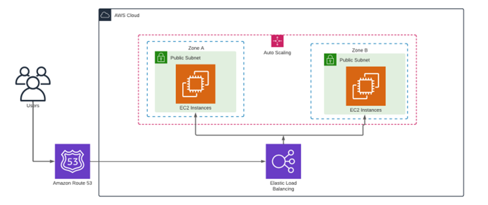

# iac-terraform-mackenzie-cloud
Repositório para atividade em dupla de terraform da disciplina Cloud Computing -

Professor: Yuri Rodrigues de Menezes  

Alunos: Higor Rodrigues de Oliveira - 10424019 | Lucas Braz Pereira - 10729862


## 🚀 Visão Geral

Este projeto provisiona uma **infraestrutura altamente disponível e escalável na AWS** utilizando Terraform.
A arquitetura implementa uma aplicação web distribuída entre **duas zonas de disponibilidade**, com **Auto Scaling**, **Load Balancer**, **Route 53** e **EC2**, garantindo resiliência, performance e custo otimizado.

---



## 🏗️ **Arquitetura Implementada**

A infraestrutura cria os seguintes componentes:

### 🔹 **Rede (VPC)**

* 1 VPC dedicada
* 2 Subnets Públicas (AZ A e AZ B)
* Internet Gateway
* Route Table pública

### 🔹 **Segurança**

* Security Group do ALB (porta 80 pública)
* Security Group das EC2 (apenas tráfego do ALB + SSH opcional)

### 🔹 **Compute**

* Launch Template com instalação automática do Apache
* Auto Scaling Group distribuído entre duas AZs
* Capacidade inicial: 2 instâncias
* Escalabilidade até 6 instâncias
* Policy de autoscaling baseada em CPU

### 🔹 **Balanceamento de Carga**

* Application Load Balancer (ALB)
* Listener na porta 80
* Target Group com health checks

### 🔹 **DNS – Route 53**

* Criação de um registro tipo A com alias apontando para o ALB

---

## 📂 **Estrutura de Arquivos**

```
/
├── main.tf
├── variables.tf
├── outputs.tf
└── README.md   👈 este documento
```

---

## ⚙️ **Pré-requisitos**

* Terraform ≥ **1.6.0**
* AWS CLI configurado com credenciais válidas
* Permissões para criar:

  * VPC
  * EC2
  * ALB
  * Route 53
  * Auto Scaling

---

## 🔧 **Como Usar**

### 1️⃣ **Inicializar o Terraform**

```sh
terraform init
```

### 2️⃣ **Validar a infraestrutura**

```sh
terraform validate
```

### 3️⃣ **Visualizar o plano**

```sh
terraform plan
```

### 4️⃣ **Criar a infraestrutura**

```sh
terraform apply
```

Após o apply, o Terraform exibirá os outputs, incluindo:

* DNS do ALB
* FQDN configurado no Route 53
* Nome do projeto

---

## 🔑 **Variáveis Principais**

As variáveis são definidas no arquivo **variables.tf**.

| Variável              | Descrição                               | Exemplo                 |
| --------------------- | --------------------------------------- | ------------------------|
| `project_name`        | Nome base do projeto                    | `SiteArquProjeto`       |
| `region`              | Região AWS                              | `us-east-1`             |
| `ami_id`              | ID da AMI (Amazon Linux 2, por exemplo) | `ami-0866a3c8686eaeeba` |
| `instance_type`       | Tipo da instância EC2                   | `t3.micro`              |
| `asg_min`             | Capacidade mínima do ASG                | `2`                     |
| `asg_max`             | Capacidade máxima                       | `6`                     |
| `route53_record_name` | Domínio                                 | `SiteArquProjeto.com.br`|

---

## 📤 **Outputs Gerados**

O arquivo **outputs.tf** entrega:

* `alb_dns_name` → endpoint público do ALB
* `route53_fqdn` → FQDN configurado no Route 53
* `project_name` → nome do projeto definido como variável

---

## 🧱 **Fluxo de Requisição**

1. Usuário acessa o domínio configurado.
2. O Route 53 resolve e direciona para o ALB.
3. O ALB distribui tráfego entre instâncias EC2 nas duas AZs.
4. O ASG ajusta automaticamente a quantidade de instâncias conforme a carga.

---

## 🏁 **Destruir a Infraestrutura**

Caso precise remover tudo:

```sh
terraform destroy
```

---